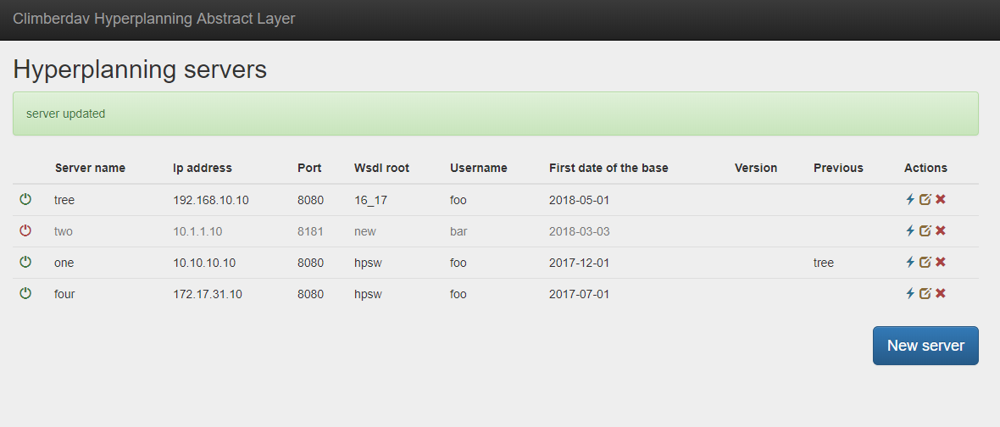
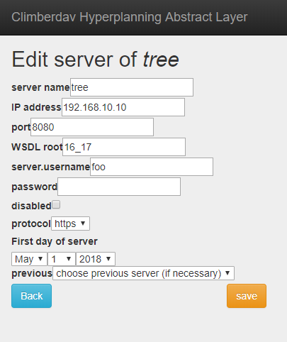

Hyperplanning Abstract Layer Bundle
====

This bundle provide an abstract layer of [Hyperplanning WebService](http://index-education.com/fr/serviceWebHP.php).

## Features

- An admin interface to add manage new reference to Hyperplanning ServiceWeb with actions:
    - test validity of the WebService
    - enabled/disable a WebService
    
- For each server, you define: 
  - a friendly name
  - an IP addresss
  - the `wsdl` root (default hpsw)
  - the first date of the base, which can be verified after
  - a previous linked server (previous year for exemple)

- Translated in french, english

## Screenshots

## Documentation

For usage documentation, see [Documentation](Resources/doc/index.md)

### Licence
This bundle is under the MIT license. See the [complete licence](Resources/meta/LICENCE) for info.